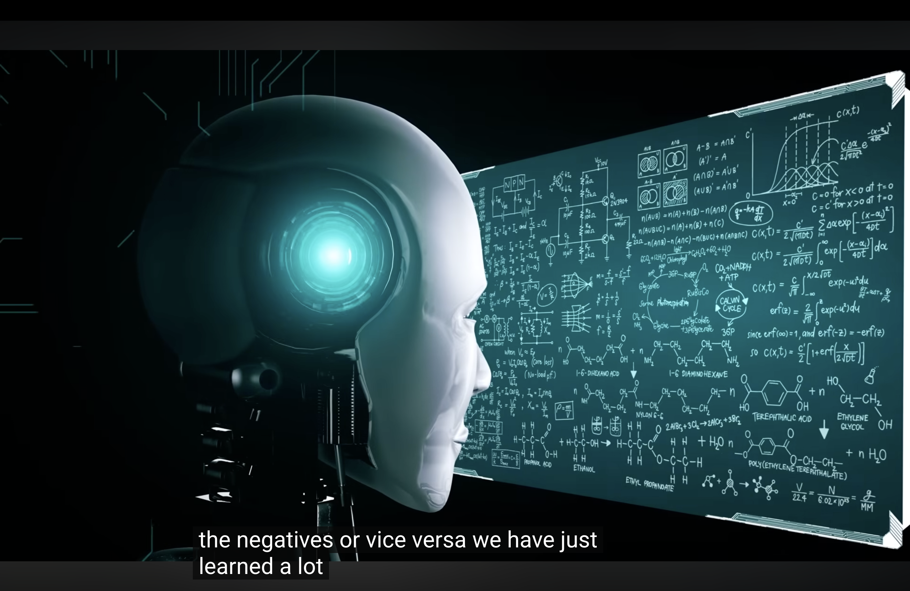
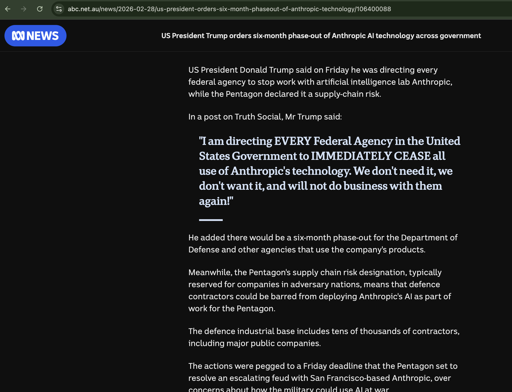
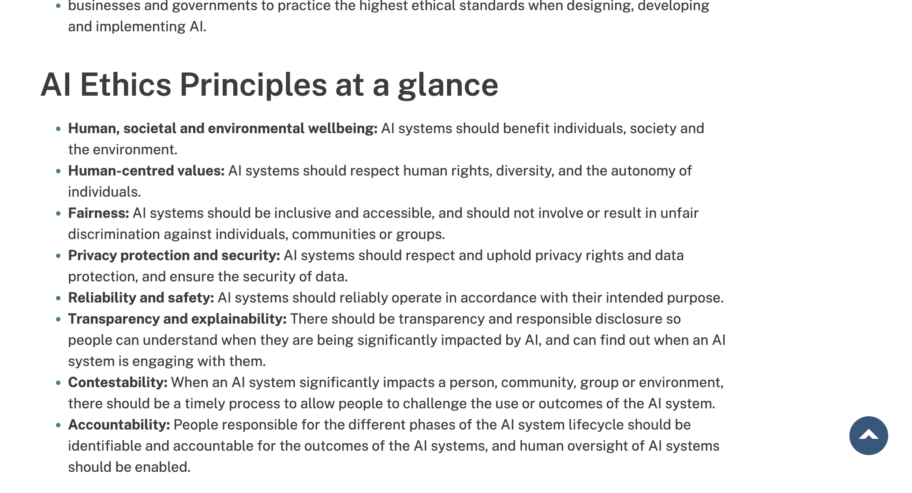

# e-portfolio-1-Artificial-Intelligence

A collection of artefacts that demonstrate what I have learnt about Artificial Intelligence this week.

## Artefact 1: What is Artificial Intelligence (AI)?

**What Is AI? | Learn all about artificial intelligence**
https://www.youtube.com/watch?v=JcXKbUIebrU&t=14s

### Summary of the artefact

### Justification on why I chose the artefact

## Artefact 2: Autonomous Weapons in Real Conflicts

**US president orders six-month phaseout of Anthropic technology**
https://www.abc.net.au/news/2026-02-28/us-president-orders-six-month-phaseout-of-anthropic-technology/106400088

### Summary of the artefact

### Justification on why I chose the artefact

## Artefact 3: Australia's National AI Plan

**Australia's AI ethics principles**
https://www.industry.gov.au/publications/australias-ai-ethics-principles

### Summary of the artefact

### Justification on why I chose the artefact

## Artefact 4: Workshop Personal Reflection

Workshop: Week / Day / Date / Tutor / Campus

### Summary of the artefact: My Personal Reflection

### Justification on why I chose the artefact

---

## References (Harvard style)