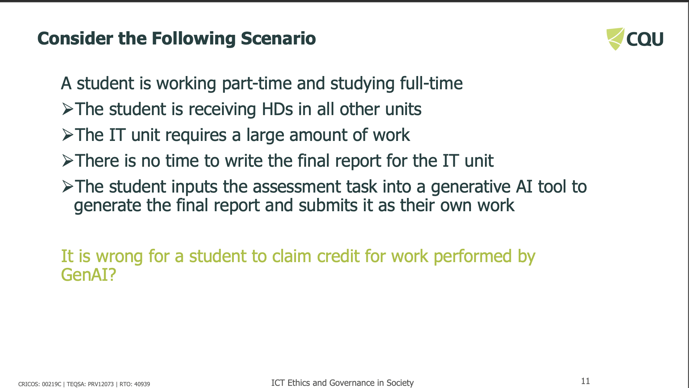
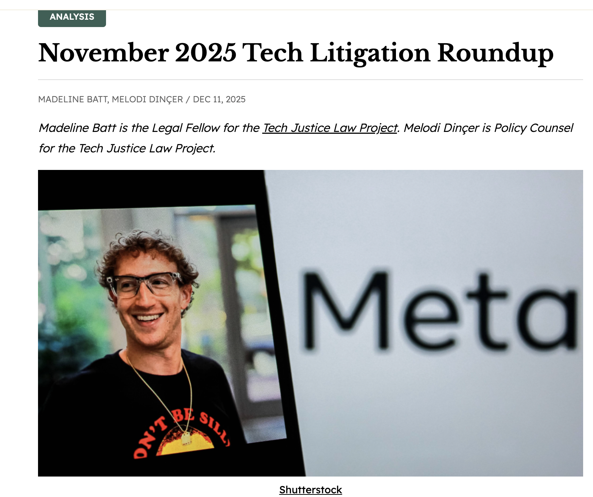
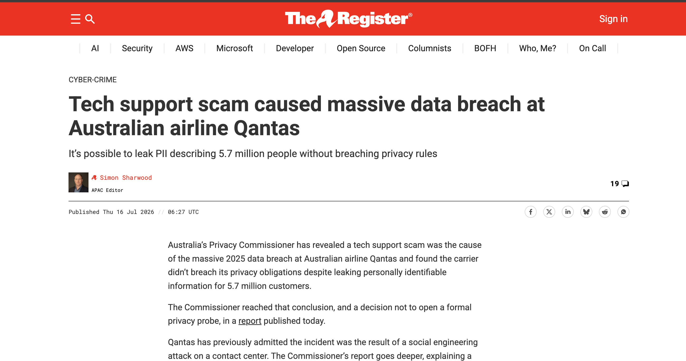
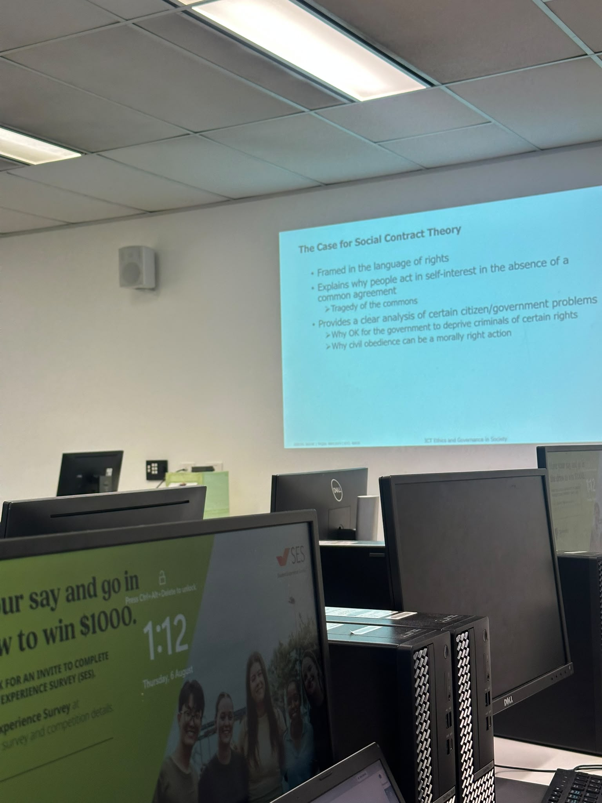

# E-Portfolio 2: Ethical Theory

A collection of artefacts that demonstrate what I have learnt about ethics and ethical theories this week.

## Artefact 1: Kantianism and the GenAI Report Scenario

**Workshop Scenario:** A student submits a GenAI-generated report as their own work.

### Summary of the Artefact
This scenario was covered in the Week 4 workshop (CQUniversity 2026) to illustrate Kantianism, an ethical theory developed by Immanuel Kant. Kant believed that rational people have dignity and deserve respect, and that an action is only good if the principle behind it is good. The scenario involves a student who is working part-time and studying full-time, and who uses a generative AI tool to write their final report for an IT unit, then submits it as their own work. Using Kant's first formulation, universalising the rule, the workshop concluded that if "claiming credit for work performed by GenAI" became a universal rule, reports would no longer indicate students' real knowledge, so the rule is self-defeating. Using the second formulation, treating people as ends and not means, the student is seen as deceiving the lecturer and using them as a means to pass the course. Both formulations conclude that what the student did was wrong.

### Justification for Choosing the Artefact
I chose this artefact because it demonstrates how Kantian ethics can be applied to a real and relevant issue involving the use of generative AI in education. The scenario clarified Kant's ideas about duty, honesty, and respect for others. By applying both formulations of the categorical imperative, I could see why submitting AI-generated work as one's own is unethical, regardless of any benefit to the student. This artefact was particularly meaningful because the use of AI tools is becoming increasingly common in higher education, making the ethical questions it raises highly relevant to both students and future ICT professionals.

---

## Artefact 2: Act Utilitarianism and OpenAI's Rushed GPT-4o Launch

**OpenAI faces lawsuits over rushed launch of GPT-4o**

### Summary of the Artefact
This article reports that OpenAI faced multiple lawsuits filed in late 2025 linking psychological harm, including cases connected to suicide, to the rushed launch of its GPT-4o model (Batt & Dinçer 2025).. The complaints allege that GPT-4o was released without adequate safety testing and exhibited higher levels of sycophancy, meaning it was overly agreeable, than earlier versions, including reduced protections around suicide-related content. Several plaintiffs reportedly used ChatGPT safely before the 4o rollout. OpenAI later made changes to reduce this behaviour after seeing the results post-launch, but reversed some of those changes following user complaints that the model had become less engaging. This case can be evaluated using Act Utilitarianism (CQUniversity 2026), a theory covered in the Week 4 workshop, which judges an action as good or bad based on whether its benefits outweigh its harms.

### Justification for Choosing the Artefact
I chose this artefact because it shows how Act Utilitarianism can be used to evaluate decisions involving emerging technologies and their social consequences. The case highlights the tension between innovation and commercial success on one hand, and potential harm to users on the other. Analysing the OpenAI lawsuit through a utilitarian lens helped me understand how ethical decisions are judged by their outcomes and overall impact on society. This example was particularly relevant given how widely the technology involved is used, and it underscored the importance of weighing both benefits and risks when deploying AI systems.

---

## Artefact 3: Social Contract Theory and the Qantas Data Breach

**Tech support scam caused massive data breach at Australian airline Qantas**

### Summary of the Artefact
This article reports that Australia's Privacy Commissioner found a 2025 data breach at Qantas, which exposed the personal information of 5.7 million customers, was caused by a tech support scam rather than a direct system failure (The Register 2026). A scammer posing as "Qantas IT help" convinced a contact centre agent to access a customer relationship management system and perform actions that allowed the attacker to extract personal data. Despite the scale of the breach, the Commissioner concluded that Qantas did not breach its privacy obligations and decided not to open a formal investigation. This case can be evaluated using Social Contract Theory (CQUniversity 2026), a theory covered in the Week 4 workshop, which considers whether companies that collect and hold large amounts of customer data have an implicit obligation to protect it, even when a breach results from deception rather than a direct security failure.

### Justification for Choosing the Artefact
I chose this artefact because it demonstrates how Social Contract Theory can be applied to contemporary issues involving cybersecurity, privacy, and organisational responsibility. The Qantas data breach highlights the trust that customers place in organisations when they provide personal information and raises important questions about whether companies are meeting their obligations to protect that information. Analysing this case through Social Contract Theory helped me understand that ethical responsibilities extend beyond simply complying with laws and regulations. Even when a breach occurs because of human deception rather than a technical vulnerability, organisations are still expected to maintain systems, training, and safeguards that uphold the trust placed in them by society. I found this artefact particularly relevant because data breaches are becoming increasingly common, making the protection of personal information a significant ethical issue for ICT professionals and organisations. 

---

## Artefact 4: Workshop Personal Reflection

**Workshop Details:** Week 4 Workshop, Thursday, 6 August 2026, Sydney Campus, Tutor: Umapathy Venugopal

### Summary of the Artefact: Personal Reflection
The Week 4 workshop (CQUniversity 2026) introduced several major ethical theories, including Kantianism, Act Utilitarianism, and Social Contract Theory. Through group discussions and case studies, I learned how different ethical frameworks can be applied to analyse real-world situations involving artificial intelligence, privacy, honesty, and public policy. The workshop showed that ethical issues often have multiple valid perspectives, and that different theories can reach different conclusions when evaluating the same scenario.

### Reflection on the Workshop
The Week 4 workshop helped me develop a deeper understanding of how ethical theories can be applied to real-world situations in technology and society. Before attending the workshop, I generally thought of ethics as simply determining whether an action was right or wrong. However, I learned that different ethical theories evaluate situations from different perspectives. Kantianism focuses on duties and moral principles, Act Utilitarianism considers the consequences of actions and their impact on overall wellbeing, and Social Contract Theory examines the obligations and expectations that exist within society.

I found the case studies particularly useful because they connected theoretical concepts to current issues involving artificial intelligence, privacy, and data security. The GenAI report scenario demonstrated the importance of honesty and academic integrity, while the OpenAI and Qantas examples showed how ethical theories can be used to analyse the responsibilities of organisations developing and managing technology. These discussions helped me recognise that ethical decision-making is often complex and requires consideration of multiple viewpoints.

Overall, the workshop improved my ability to critically evaluate ethical issues and strengthened my understanding of the responsibilities that ICT professionals have when designing, implementing, and managing technology. I believe the knowledge gained from this workshop will be valuable in both my future studies and my professional career.

---

## References

Batt, M & Dinçer, M 2025, 'November 2025 Tech Litigation Roundup', TechPolicy.Press, 11 December 2025, viewed 7 August 2026, https://www.techpolicy.press/november-2025-tech-litigation-roundup/

CQUniversity 2026, COIT11223 ICT Ethics and Governance in Society, Week 4: Ethics and Ethical Theories, workshop slides, CQUniversity, Sydney.

The Register 2026, 'Tech support scam caused massive data breach at Australian airline Qantas', The Register, 16 July 2026, viewed 7 August 2026, https://www.theregister.com/cyber-crime/2026/07/16/tech-support-scam-caused-massive-data-breach-at-australian-airline-qantas/5272267