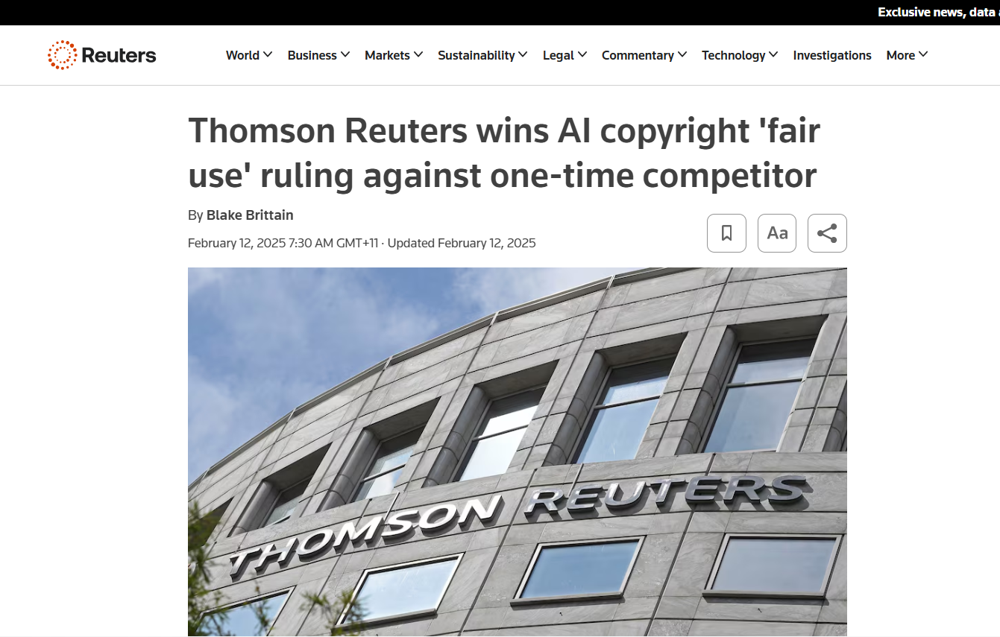
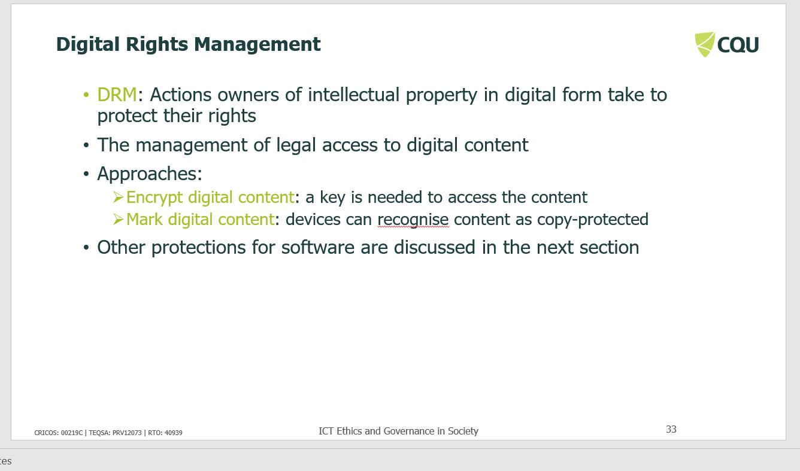
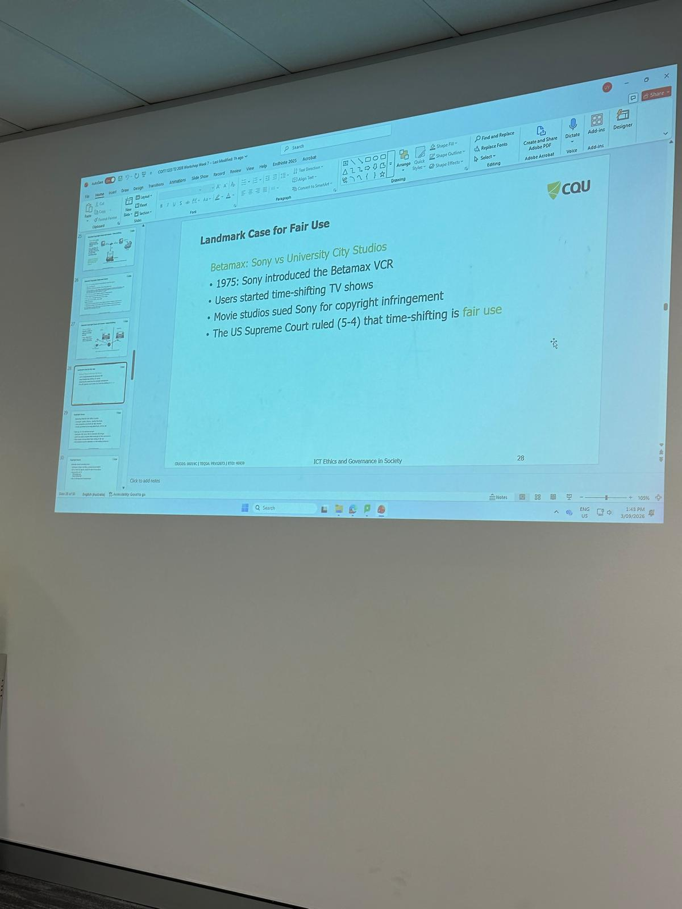

# E-Portfolio 3: Intellectual Property

A collection of artefacts that demonstrate what I have learnt about intellectual property during Week 7. The workshop explored how copyright, patents, trademarks, trade secrets and digital protections can protect creators while also raising important questions about access, ownership, fair use and the responsibilities of ICT professionals.

## Artefact 1: Copyright and Artificial Intelligence

### Artefact

**Copyright and AI ? Transparency discussion paper**

Australian Government, Attorney-General's Department  
Published: 4 February 2025

[View the Copyright and AI ? Transparency discussion paper](https://www.ag.gov.au/rights-and-protections/publications/copyright-and-ai-transparency-discussion-paper)

### Summary of the Artefact

The Australian Government's *Copyright and AI ? Transparency discussion paper* examines emerging copyright concerns created by the development and use of artificial intelligence. It focuses particularly on transparency surrounding the use of copyright-protected material as inputs for AI systems and considers whether government action may be needed in this area. The paper was circulated to the Copyright and Artificial Intelligence Reference Group (CAIRG) for stakeholder input and forms part of Australia's broader consideration of how existing copyright principles should operate as AI technologies continue to develop (Attorney-General's Department 2025).

### Justification for Choosing the Artefact

I chose this artefact because it connects directly with the Week 7 discussion about how intellectual property law must balance the rights of creators with technological innovation. It helped me understand that AI creates new challenges for copyright because protected material can potentially be used during the development of AI systems. As a future ICT professional, I think transparency about the use of copyright material is important because developers should consider both legal obligations and the interests of original creators.

---

## Artefact 2: AI Copyright and Fair Use - Thomson Reuters v ROSS Intelligence

### Artefact

**Thomson Reuters wins AI copyright 'fair use' ruling against one-time competitor**

Reuters  
Published: 11 February 2025

[View the Reuters article](https://www.reuters.com/legal/thomson-reuters-wins-ai-copyright-fair-use-ruling-against-one-time-competitor-2025-02-11/)

### Summary of the Artefact

The Reuters article reports on a 2025 United States copyright decision involving Thomson Reuters and ROSS Intelligence, an artificial intelligence legal research company. The dispute concerned material connected to Thomson Reuters' Westlaw legal research platform that was used while ROSS was developing a competing AI-based legal research service. The court found copyright infringement and rejected ROSS's argument that its use of the material qualified as fair use. The decision is significant because it demonstrates how existing copyright principles are being tested as companies use protected material when developing artificial intelligence systems (Reuters 2025).

### Justification for Choosing the Artefact

I chose this artefact because it closely connects with the Week 7 discussion about fair use and the limits placed on copying copyright-protected material. The case helped me understand that technological innovation does not automatically justify using another organisation's intellectual property. I found this particularly relevant to my future work in ICT because developers need to understand where training and development data comes from, whether permission is required, and how their technical decisions may affect the rights of content owners.

---

## Artefact 3: Digital Rights Management and Protection of Digital Content

### Artefact

**Week 7 Workshop Slide: Digital Rights Management**

COIT11223 ICT Ethics and Governance in Society  
Week 7: Intellectual Property  
CQUniversity, 2026

### Summary of the Artefact

This Week 7 workshop slide explains Digital Rights Management (DRM) as actions taken by owners of intellectual property in digital form to protect their rights and manage legal access to digital content. The slide identifies two important DRM approaches. Digital content can be encrypted so that a key is required before the material can be accessed, or content can be marked so that devices recognise it as copy-protected. The artefact demonstrates how technological controls can be used alongside intellectual property law to regulate access to and use of digital material (CQUniversity 2026).

### Justification for Choosing the Artefact

I chose this artefact because it helped me understand that intellectual property protection is not limited to copyright law alone. Technical measures can also control how digital material is accessed and used. I found the encryption example particularly useful because it connected the legal topic of intellectual property with practical ICT security mechanisms. As a future ICT professional, this made me think more carefully about balancing the rights of content owners with legitimate access by users.

---

## Artefact 4: Week 7 Workshop Reflection

### Workshop Evidence

**COIT11223 Week 7 Workshop - Intellectual Property**

This photograph provides evidence of my attendance and participation in the Week 7 workshop on Intellectual Property.

### Key Workshop Idea

**Balancing intellectual property protection with access, innovation and user rights**

### Summary of the Artefact

To be developed.

### Justification for Choosing the Artefact

To be developed.

---

## AI Use Statement

To be completed.

## References

To be completed.
