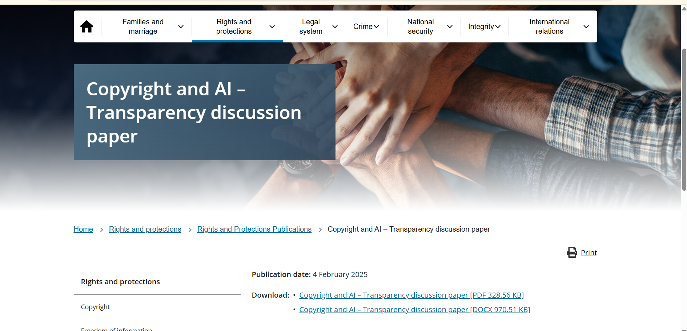

# E-Portfolio 3: Intellectual Property

A collection of artefacts that demonstrate what I have learnt about intellectual property during Week 7. The workshop explored how copyright, patents, trademarks, trade secrets and digital protections can protect creators while also raising important questions about access, ownership, fair use and the responsibilities of ICT professionals.

## Artefact 1: Copyright and Artificial Intelligence

### Artefact

**Copyright and AI ? Transparency discussion paper**

Australian Government, Attorney-General's Department  
Published: 4 February 2025

[View the Copyright and AI ? Transparency discussion paper](https://www.ag.gov.au/rights-and-protections/publications/copyright-and-ai-transparency-discussion-paper)

### Summary of the Artefact

The Australian Government's *Copyright and AI ? Transparency discussion paper* examines copyright issues arising from the growing use of artificial intelligence. It considers the need for greater transparency about how copyright material may be used as input for AI systems and how AI-generated outputs are produced. The paper formed part of consultation with the Copyright and Artificial Intelligence Reference Group (CAIRG) on possible policy responses.

### Justification for Choosing the Artefact

To be developed.

---

## Artefact 2

### Artefact

To be added.

### Summary of the Artefact

To be developed.

### Justification for Choosing the Artefact

To be developed.

---

## Artefact 3

### Artefact

To be added.

### Summary of the Artefact

To be developed.

### Justification for Choosing the Artefact

To be developed.

---

## Artefact 4: Week 7 Workshop Reflection

### Workshop Details

Week 7 Workshop

Topic: Intellectual Property

### Workshop Evidence

To be added.

### Summary of the Artefact

To be developed.

### Justification for Choosing the Artefact

To be developed.

---

## AI Use Statement

To be completed.

## References

To be completed.
