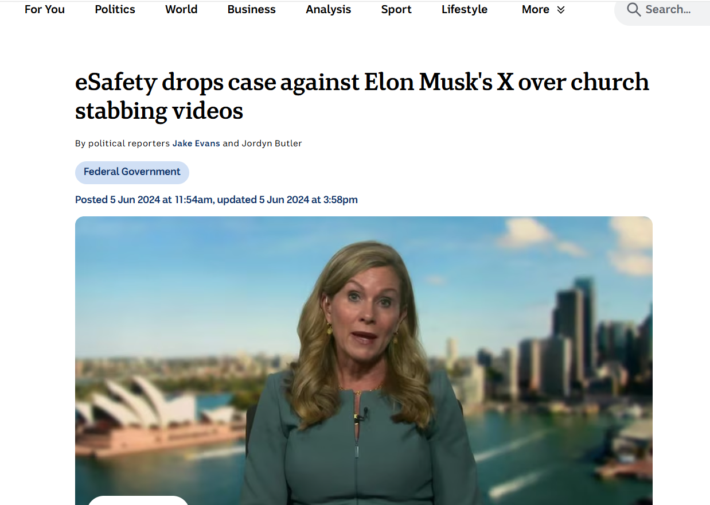
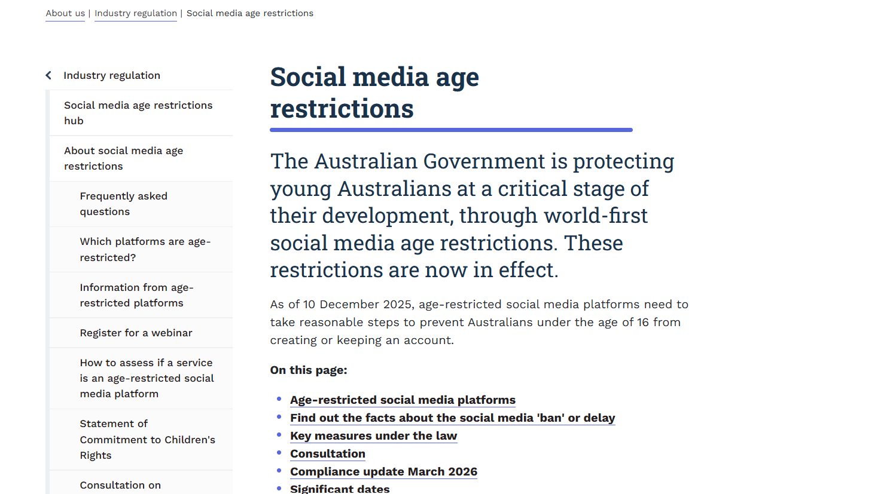
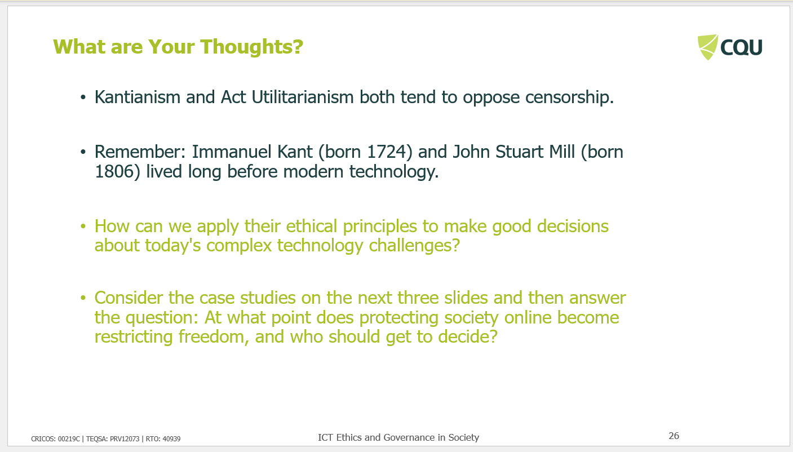
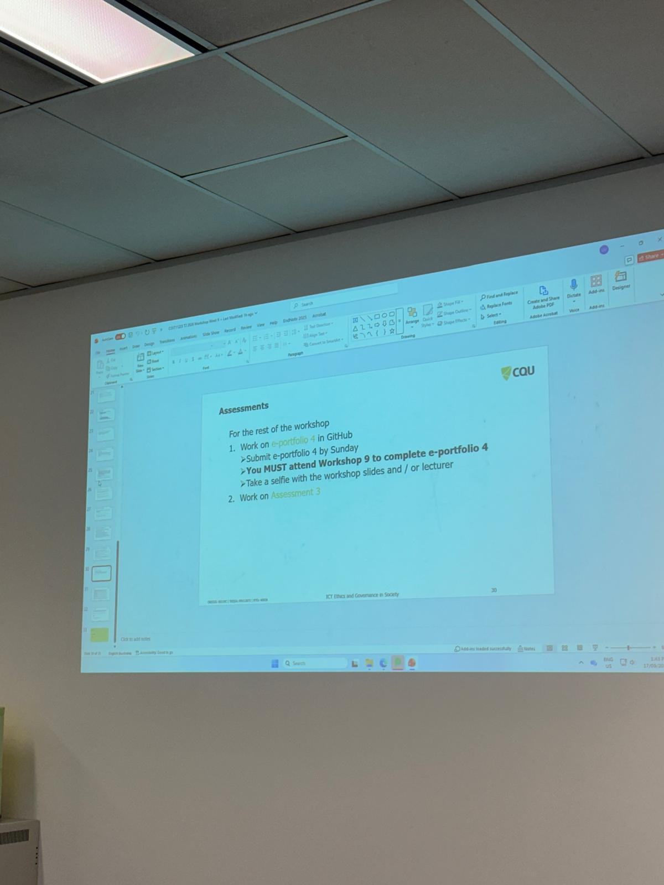

# E-Portfolio 4: Censorship and Government

This e-portfolio presents four artefacts that demonstrate what I learned about censorship and government during Week 9. The workshop examined how governments, technology companies and other organisations can regulate access to online information, as well as the ethical tension between protecting society from harmful content and preserving freedom of expression. It also explored internet blocking, private-platform regulation, classification systems and the responsibilities of ICT professionals.

## Artefact 1: eSafety Commissioner vs X - Online Safety and Freedom of Expression

### Artefact

**eSafety drops case against Elon Musk's X over church stabbing videos**

ABC News  
Published: 5 June 2024

[View the ABC News article](https://www.abc.net.au/news/2024-06-05/esafety-elon-musk-x-church-stabbing-videos-court-case/103937152)

### Summary of the Artefact

The ABC News article reports that Australia's eSafety Commissioner abandoned a Federal Court case seeking the removal of graphic church-stabbing footage from X. The dispute followed X's resistance to the removal action and became an important test of Australia's ability to enforce online-safety requirements on a global social media platform. It demonstrates the tension between regulating harmful online material and protecting freedom of expression (Evans & Butler 2024).

### Justification for Choosing the Artefact

To be developed.

---

## Artefact 2: Australia's Social Media Age Restrictions

### Artefact

**Social media age restrictions**

eSafety Commissioner  
Australian Government  
Restrictions effective: 10 December 2025

[View the official eSafety Commissioner source](https://www.esafety.gov.au/about-us/industry-regulation/social-media-age-restrictions)

### Summary of the Artefact

The eSafety Commissioner explains Australia's social media age restrictions, which require age-restricted platforms to take reasonable steps to prevent Australians under 16 from creating or keeping accounts. The restrictions took effect on 10 December 2025 and apply to major platforms including Facebook, Instagram, TikTok, X and YouTube. The policy demonstrates how governments can regulate access to online services in an attempt to reduce risks to younger users (eSafety Commissioner 2026).

### Justification for Choosing the Artefact

I chose this artefact because it shows how government regulation can be used to protect younger users while also limiting access to online platforms. It made me consider whether restricting social media accounts is an appropriate safety measure and how such rules may affect communication, participation and access to information. As an ICT student, I found this relevant because technology professionals may need to design and enforce systems that balance user safety with individual rights.

---

## Artefact 3: Protecting Society Online vs Freedom of Expression

### Artefact

**Week 9 Workshop Slide: What are Your Thoughts?**

COIT11223 ICT Ethics and Governance in Society  
Week 9: Censorship and Government  
CQUniversity, 2026

**Key question:** At what point does protecting society online become restricting freedom, and who should get to decide?

### Summary of the Artefact

The Week 9 workshop slide asks how ethical principles such as Kantianism and Act Utilitarianism can be applied to modern censorship issues. It highlights that both perspectives generally oppose censorship, while also asking students to consider situations where online restrictions may be used to protect society. The key question is where legitimate protection ends and an unacceptable restriction on freedom begins (CQUniversity 2026).

### Justification for Choosing the Artefact

I chose this artefact because the question made me think beyond whether censorship is simply good or bad. I learned that decisions about online content require balancing safety with freedom of expression. As an ICT student, I found the question of who should make these decisions important because governments and technology companies can both influence what users are able to access online.

---

## Artefact 4: Week 9 Workshop Reflection

### Workshop Evidence

**COIT11223 Week 9 Workshop - Censorship and Government**

CQUniversity, 2026

This photograph provides evidence of my attendance and participation in the Week 9 workshop on Censorship and Government.

### Key Workshop Idea

**Balancing online safety with freedom of expression and deciding who should regulate online content**

### Summary of the Artefact

The Week 9 workshop showed that censorship decisions involve more than simply removing harmful content. Governments and private technology companies can both influence what users are able to access online, creating ethical questions about safety, privacy, freedom of expression and possible overreach. A central idea was that censorship should be considered in terms of who makes the decision, what harm it seeks to prevent and how much freedom it restricts (CQUniversity 2026).

### Justification for Choosing the Artefact

I chose this workshop artefact because it changed how I think about censorship. Before the workshop, I mainly viewed censorship as blocking harmful content. I now understand that the issue is more complex because restrictions can protect users but may also limit freedom of expression or give too much control to governments or technology companies. This is important to me as an ICT student because technical systems can directly influence what information people are able to access.

---

## AI Use Statement

I used generative AI to support planning, idea generation and organisation. I verified relevant information against the Week 9 workshop materials and original sources, and reviewed and revised the final submission in my own words.

## References

CQUniversity 2026, *COIT11223 ICT Ethics and Governance in Society, Week 9: Censorship and Government*, workshop slides, CQUniversity.

eSafety Commissioner 2026, *Social media age restrictions*, Australian Government, viewed 23 September 2026, <https://www.esafety.gov.au/about-us/industry-regulation/social-media-age-restrictions>.

Evans, J & Butler, J 2024, 'eSafety drops case against Elon Musk's X over church stabbing videos', *ABC News*, 5 June, viewed 23 September 2026, <https://www.abc.net.au/news/2024-06-05/esafety-elon-musk-x-church-stabbing-videos-court-case/103937152>.
